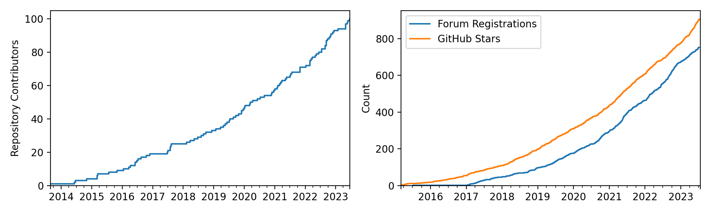
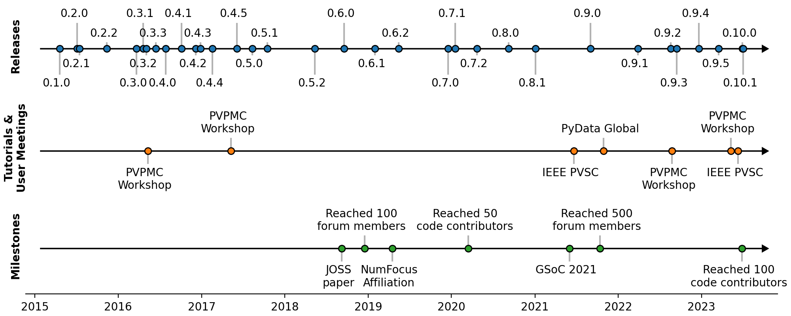

# Summary

pvlib python is a community-developed, open-source software toolbox
for simulating the performance of solar photovoltaic (PV) energy
systems.  It provides peer-reviewed reference implementations of
over 100 empirical and physics-based models from the scientific literature,
including solar position algorithms, irradiance models, thermal models,
and PV electrical models.  In addition to these individual low-level
model implementations, pvlib python provides high-level constructs
that chain these models together like building blocks to form complete
"weather-to-power" phovoltaic system models.  It also provides functions to
fetch and import weather datasets useful for PV modeling. 

Unlike other popular software for PV modeling, pvlib python has the benefit
of integrating natively with a general-purpose programming language (Python).
In addition to being more flexible and powerful than a traditional graphical
user interface, pvlib python's interface as a programming library
allows it to be combined with other Python packages.  This enables
integration with database query, data manipulation, numerical optimization,
plotting, and reporting packages, to name just a few.

pvlib python has been developed since 2015 and follows modern best
practices for open-source python software, with comprehensive automated
testing, standards-based packaging, and semantic versioning.  Its emphasis
on re-use, community, transparency, and peer review has lead to its widespread
adoption across the PV field [@Stein2022].
Here we present an update on pvlib python describing capability
and community development since our 2018 publication [@pvlibjoss2018].

# Statement of need

Simulation tools are used throughout the field of solar phovoltaics.
As photovoltaic technologies and systems become increasingly diverse and
sophisticated, and as the solar energy industry rapidly grows,
so do the demands placed on these simulation tools.  Flexibility, scalability,
and transparency are key requirements to meet this demand.  Regarding
trustworthy and capable photovoltaic modeling software, the U.S. Department
of Energy states that "the importance of accurate modeling is hard to overstate"
[@seto2022].

pvlib python's reusable toolbox design, along with being embedded within the
broader Python and PyData ecosystems, offers a flexibility and scalability
unmatched by any other solar energy simulation tool.  Its foundation in
published scientific research and open peer review approach make it
a leader in transparency in the photovoltaic modeling space.

The fact that pvlib python is meeting real needs is made evident by several metrics:

1. Its 2018 JOSS publication, at the time of this writing,
ranks 14th by citation count out of the 2000+ papers published by JOSS to date.
2. The Python Package Index (PyPI) classifies pvlib-python as "critical project"
due to being in the top 1% of the index's packages by download count.
3. The project's online documentation received over 400,000 page views
in the past year.

# Functionality additions

To meet new needs of the PV industry, substantial new functionality has been
added in the roughly five years since the 2018 JOSS publication.

First, several dozen new models have been
implemented, expanding the package's capability in both existing and new
modeling areas and prompting the creation of several
new modules within pvlib python.
Notable additions include models for loss mechanisms like soiling and snow
coverage, and methods of fitting PV performance models to measurements.
Also, to meet the demand for modeling bifacial PV which has become
mainstream in recent years, new models have been added to pvlib to
model rear-side irradiance.
\autoref{fig:functions-comparison} summarizes the number of models per module
for pvlib python versions 0.6.0 and 0.10.0.

Second, in addition to the new function-level model implementations,
the package's high-level classes have also been expanded to handle the complexity
of emerging system designs, including systems with different
mounting or electrical parameters between subsystems and systems that require
custom orientation/steering models.

Third, the creation of `pvlib.iotools`, a sub-package for fetching and parsing
datasets relevant to PV modeling.  These functions provide a standardized
interface for reading data files in various complex data formats, offering
conveniences like optionally standardizing the dataset labels and units
to pvlib conventions [@Jensen2023].  As of version 0.10.0, `pvlib.iotools` contains
functions to download data from half a dozen weather dataset providers (UPDATE),
plus file reading/parsing functions for twice that number of solar resource file formats.

These additions are discussed in more detail in [@pvpmc_2023_update] and [@pvpmc2022_pvlib_update].
Complete descriptions of the changes in each release can be found in the
project's documentation.

# Community

It is difficult or impossible to comprehensively describe the community around
open-source projects like pvlib python, but some aspects of it are more easily
quantifiable than others.  Here we examine the community from a few convenient
perspectives, but we emphasize that this is necessarily a limited view of
the community as a whole.

First, we examine contributors to pvlib python's code repository.  The
project's use of version control software enables easy quantification of
repository additions (to code, documentation, tests, etc) over time.  The
project's repository currently comprises contributions from over 100 people
spanning industry, academia, and government research institutions.
\autoref{fig:community} shows the number of unique repository
contributors over time, demonstrating continued and generally accelerating
attraction of new contributors.

However, the project as a whole is the product of not only of those who contribute
code but also those who submit bug reports, propose ideas for new features,
participate in online fora, and support the project in other ways.
Along those lines, two easily tracked metrics are the number of people
registered in the pvlib python online discussion forum and the number of
GitHub "stars" on the pvlib python code repository. Although these numbers
almost certainly substantially underestimate the true number of pvlib users,
their increase over time illustrates healthy community development.

In addition to continuous interaction online, community members sometimes
meet in person at user's group and tutorial sessions run by pvlib python
maintainers and community members alike.
To date, these meetings have been held at the IEEE Photovoltaics Specialists
Conference (PVSC), the PVPMC Workshops, and PyData Global.
\autoref{fig:timeline} shows a timeline of these meetings, along with other
notable events in the project's history.

Finally, it is worth pointing out that pvlib python contributors and users
are part of a broader community around not just
pvlib python but also other members of the pvlib "family": pvanalytics, a
package for PV data quality assurance and feature recognition
algorithms [@pvpmc2022_pvanalytics_update], and twoaxistracking, a package
for simulating self-shading in arrays of two-axis solar trackers [@Jensen2022].
Moreover, looking outside pvlib and its affiliated packages, we see that Python
is proving to be the most common programming language for open-source PV
modeling and analysis software in general.  The packages mentioned here
make up one portion of a growing landscape of Python-for-PV projects [@Holmgren2018].

# Acknowledgements

Although much of the development and maintenance of pvlib python is on a
volunteer basis, the project has also benefited from projects funded by various
sources, including:

- The U.S. Department of Energy’s Solar Energy Technology Office, through
  the PV Performance Modeling Collaborative (PVPMC) and other projects
- NumFOCUS's Small Development Grant program
- Google's Summer of Code program

pvlib python benefits enormously from building on top of
various high-quality packages that have become de facto standards in the python
ecosystem: numpy, pandas, scipy, numba (numerics), matplotlib (plotting),
sphinx (documentation), and pytest (automated testing).
The project also benefits from online infrastructure generously provided free
of charge, including GitHub (code development and automated testing) and
ReadTheDocs.org (documentation building and hosting).

# NOTES/TODO

Additional authors? 

- PVPMC?  Josh, Marios, Dan
- Tutorials?  Silvana
- Former pvlib python contributors?  Rob, Tony, Cameron, etc

The future?  Commercial adoption?

# References
