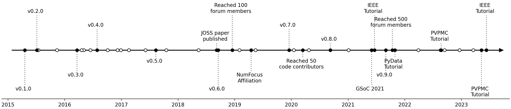
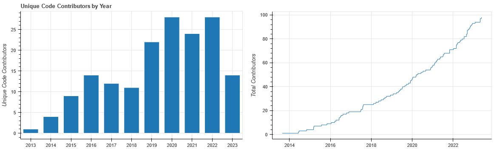

# Summary

pvlib python is a community-supported, open-source software toolbox
for simulating the performance of solar photovoltaic (PV) energy
systems.  It provides implementations of over 100 empirical and
physics-based models from the photovoltaic modeling scientific literature,
including solar position algorithms, irradiance models, thermal models,
and PV electrical models.  In addition to these individual low-level
model implementations, pvlib python provides high-level constructs
that chain these models together like building blocks to form complete
"weather-to-power" phovoltaic system models.  It also provides functions to fetch
and import datasets useful for PV modeling.  Unlike other
popular software for PV modeling, pvlib python integrates natively
with the rest of the Python ecosystem, making it easy to combine with
packages for numerical optimization, plotting, and data manipulation,
to list a few.

pvlib python has been developed since 2013 and follows modern best
practices for open-source python software, with comprehensive automated
testing, standards-based packaging, and semantic versioning.
\autoref{fig:timeline} shows a timeline of important events in
the project's history.

Here we present an update describing capability enhancements and community
growth since our 2018 publication [@pvlibjoss2018].

# Statement of need

Simulation tools are used throughout the field of solar phovoltaics.
As photovoltaic technologies and economics become increasingly diverse and
sophisticated, and as the solar energy industry rapidly grows,
so do the demands placed on these simulation tools.  Flexibility, scalability,
and transparency are key requirements to meet this demand.  Regarding
trustworthy and capable photovoltaic modeling software, the U.S. Department
of Energy states that "the importance of accurate modeling is hard to overstate"
[@seto2022].

pvlib python's reusable toolbox design, along with being embedded within the
broader Python and PyData ecosystems, offers a flexibility and scalability
unmatched by any other solar energy simulation tool.  Its permissive
open-source license and foundation in published scientific research make it the
gold standard of transparency in the photovoltaic modeling space.

The fact that pvlib python is meeting real needs is made evident by several metrics:

1. Its 2018 JOSS publication, at the time of this writing,
ranks 14th by citation count out of the 2000+ papers published by JOSS to date.
2. The project is labeled a "critical project" on the Python Package Index
(PyPI) due to being in the top 1% of all indexed python packages by download count.
3. The project's online documentation received over 400,000 page views
in the past year.

# Functionality additions from v0.6.0 to v0.9.5

Substantial new functionality has been added in the roughly five years
since the 2018 JOSS publication.  First, several dozen new models have been
implemented, expanding the package's capability in both existing and new
modeling areas and prompting the creation of several
new modules within pvlib python.  Notable additions include models for rear-side
irradiance for bifacial PV systems, models for loss mechanisms like soiling
and snow coverage, and methods of fitting PV performance models to measurements.
\autoref{fig:functions-comparison} summarizes the number of models per module
for pvlib python versions 0.6.0 and 0.9.5.

Second, in addition to the new function-level model implementations,
the package's high-level classes have also been expanded to be able to
simulate more complex system designs, including systems with different
mounting or electrical parameters between subsystems and systems that require
custom orientation/steering models.

Third, the creation of `pvlib.iotools`, a sub-package for fetching and parsing
datasets relevant to PV modeling.  These functions provide a uniform interface
for reading data files in various formats and from various sources.  Additionally,
they offer conveniences like optionally standardizing the dataset labels and units
to pvlib conventions.  As of version 0.9.5, `pvlib.iotools` contains
functions to download data from half a dozen weather dataset providers,
plus file reading/parsing functions for twice that number of solar resource file formats.

These additions are discussed in more detail in [@pvpmc_2023_update] and [@pvpmc_2022_update].
Complete descriptions of the changes in each release can be found in the
project's documentation.

# Community

pvlib python's codebase contains contributions from over 100 people, spanning
industry, academia, and government research institutions.
\autoref{fig:contributors} tracks the number of code contributors over time.

However, the project as a whole is the product of not only of those who contribute
code but also those who submit bug reports, propose ideas for new features,
answer usage questions in online fora, and support the project in other ways.
Quantifying the scale of this broader community is difficult, but we can at
least report two easily tracked metrics: the number of people registered in
the pvlib python online discussion forum, and the number of GitHub stars on
the pvlib python code repository.  Although these numbers are likely substantial
underestimates of the true number of pvlib users, their increase over time
illustrates healthy community development: 

Finally, we highlight the pvlib tutorial sessions and users group meetings
run by both pvlib python maintainers and broader community members in recent
years.  To date, these meetings have been held at the IEEE Photovoltaics Specialists
Conference (PVSC), the PV Performance Modeling Workshops, and PyData Global.

# Acknowledgements

Although much of the development and maintenance of pvlib python is on a
volunteer basis, the project has also benefited from projects funded by various
sources, including:

- The U.S. Department of Energy’s Solar Energy Technology Office, through
  the PV Performance Modeling Collaborative and other projects
- NumFOCUS's Small Development Grant program
- Google's Summer of Code program

pvlib python benefits enormously from building on top of
various high-quality packages that have become de facto standards in the python
ecosystem.  Here is an incomplete list of such packages used in pvlib python:

- Numerics: numpy, pandas, scipy, numba
- Plotting: matplotlib
- Documentation: sphinx
- Testing: pytest

The project also benefits from online infrastructure generously provided free
of charge, including GitHub (code development and automated testing) and
ReadTheDocs.org (documentation building and hosting).

# NOTES/TODO

Additional authors? 

- PVPMC?  Josh, Marios, Dan
- Tutorials?  Silvana
- Former pvlib python contributors?  Rob, Tony, Cameron, etc

The future?

Other "pvlib family" projects?

# References
